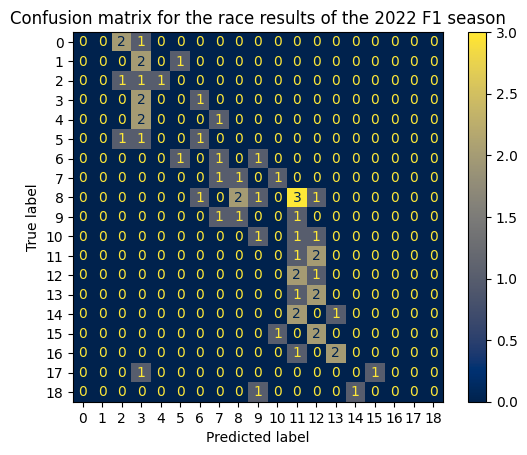

# Predicting Formula 1 Race Results Using Machine Learning
My final project for Applied Physics 157 under Dr. Reinabelle Reyes

- Used current and previous F1 season data from Kaggle
- Implemented machine learning techniques to predict F1 race outcomes using data from prior session results
- Identified the random forest regressor as the most accurate model

- Predicted finishing positions within a certain range of their actual outcome
